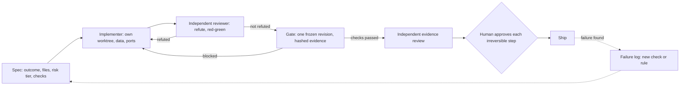

# Agent Operating Kit

## What it is

A Claude Code plugin, plus plain templates, that packages how I run AI coding agents on real projects. It has agents write a spec before code, gets an independent reviewer to try to disprove every "done", freezes one exact candidate before anything ships, leaves enough state for a fresh agent to resume cold, and turns each failure into a check instead of a reminder.

**Status:** v0.1.0, pre-release. It has not been used on a real project yet.

## Who it is for

People who direct coding agents (Claude Code, Codex, Cursor and similar) on software that touches real data, users or money, or who run several agents in one repository. Skip most of it for a throwaway spike.

## Quickstart

**As a plugin** (Claude Code):

```
/plugin marketplace add mepotts/agent-operating-kit
/plugin install agent-operating-kit@agent-operating-kit
/agent-operating-kit:sprint add rate limiting to the export endpoint
```

The GitHub form works once the repository is published. Until then, use a local clone: `/plugin marketplace add ./agent-operating-kit` for the first line.

**Without the plugin**, for any agent: copy `templates/AGENTS.md` to your repo root as `AGENTS.md` and fill the `<FILL>` lines. Claude Code users also copy `templates/CLAUDE.starter.md` to `CLAUDE.md`. Add the other templates when you need them.

## What's inside

| Piece | Contents |
|---|---|
| Skills (6) | `sprint-spec`, `risk-tiers`, `refute-review`, `release-gate`, `handoff`, `failure-to-rule`. Claude loads one when your request matches. |
| Commands (6) | `/agent-operating-kit:` then `sprint`, `refute`, `gate`, `checkpoint`, `resume` or `postmortem`. You run these. |
| Agents (2) | `refuting-reviewer` tries to disprove "done". `auditor` works as a finder, then as a skeptic. Neither has edit tools. |
| Templates | `AGENTS.md`, `CLAUDE.starter.md`, `SPRINT.md`, `GATE.md`, `HANDOFF.md`, `FAILURE-LOG.md` |
| Example | `examples/expired-coupon`: an illustrative sprint from spec to rule, with a runnable toy gate |
| Checks | `scripts/validate.py` and its self-test, `evals/`, a CI workflow, and `VERIFICATION.md` |

## The loop



## Limitations

- **One author.** The method comes from my own projects. This packaging is new and unpublished, and nothing here shows it beats working without it.
- **Instructions are not enforcement.** Skills, agents and `AGENTS.md` steer a model; they block nothing. "No edit tools" is real, but the reviewer still has Bash, limited only by its instructions. Put hard limits in permission rules and CI.
- **No hooks, MCP servers or gate runner.** The example gate is a toy; build yours around your stack.
- **Cost.** About 1.2k tokens of skill, command and agent descriptions are added to every session while the plugin is enabled (an estimate from `claude plugin details`). The reviewer defaults to the strongest model at high effort, and multi-agent review multiplies tokens. Edit `model:` and `effort:` in `agents/` if you disagree.
- **Heavy for small work.** Tiers and gates fit software with real users or data.
- **Narrow testing.** Developed on Windows 11 with Claude Code 2.1.39 and 2.1.275. macOS, Linux and GitHub CI are untested. Codex and other tools can use the templates but not the skills, commands or agents.
- **Evals are shallow.** They check that skills trigger and that the reviewer catches a planted defect from text. They do not measure whether the kit improves outcomes.

## Provenance and checks

I designed this method over 100+ agent-run sprints on a production app. AI agents (Claude Code) wrote this kit's files under my direction; here's how it was checked:

- `claude plugin validate --strict` passes on the marketplace, manifest, skills, agents and commands (2.1.275). The manifests also pass on 2.1.39.
- `scripts/validate.py` passes all 49 rules, and `scripts/test_validate.py` shows each rule failing on a planted defect.
- `claude plugin eval` (2.1.275, Sonnet): 8 of 9 cases at 1.00 after fixes. The skill fired in 18 of 18 trigger runs. The reviewer failed a planted false "done" in 3 of 3 runs and passed a true claim in 3 of 3. The first run scored far lower (2 of 9 cases), and I changed skills and fixtures after it, so treat the numbers as fitted to this suite, not held out.
- Not checked: use by anyone else, other operating systems, and GitHub CI.

Commands, dates, costs and failures are in [VERIFICATION.md](VERIFICATION.md).

## License

MIT. See [LICENSE](LICENSE).
