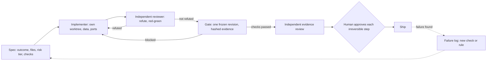

# Agent Operating Kit

## What it is

The kit is a Claude Code plugin, plus plain templates. It packages how I run AI coding agents on real projects.

The method has five steps:

1. Write a spec before any code.
2. Get an independent reviewer to try to disprove each "done".
3. Freeze one exact candidate before anything ships.
4. Leave enough state for a fresh agent to resume cold.
5. Turn each failure into a check that fails loudly next time.

**Status:** v0.1.0, pre-release. It has not been used on a real project yet.

AI agents (Claude Code) wrote this kit's files under my direction. I decided what to build, wrote the specs, and had the agents build its evals.

## Who it is for

The kit is for people who direct coding agents on software that touches real data, users or money. The agents can be Claude Code, Codex, Cursor and similar tools.

It also fits anyone who runs several agents in one repository.

Skip most of it for a throwaway spike.

## Quickstart

**As a plugin** (Claude Code):

```
/plugin marketplace add mepotts/agent-operating-kit
/plugin install agent-operating-kit@agent-operating-kit
/agent-operating-kit:sprint add rate limiting to the export endpoint
```

I tested the GitHub install above on Claude Code 2.1.39 on 2026-10-02. To install from a local clone instead, make the first line `/plugin marketplace add ./agent-operating-kit`.

**Without the plugin** (any agent):

1. Copy `templates/AGENTS.md` to your repo root as `AGENTS.md`.
2. Fill the `<FILL>` lines.
3. Copy `templates/CLAUDE.starter.md` to `CLAUDE.md` if you use Claude Code.
4. Add the other templates when you need them.

## What's inside

**Skills (6):** `sprint-spec`, `risk-tiers`, `refute-review`, `release-gate`, `handoff`, `failure-to-rule`. Claude loads one when your request matches.

**Commands (6):** `/agent-operating-kit:` then `sprint`, `refute`, `gate`, `checkpoint`, `resume` or `postmortem`. You run these.

**Agents (2):** `refuting-reviewer` tries to disprove "done". `auditor` works as a finder, then as a skeptic. Neither has edit tools.

**Templates:** `AGENTS.md`, `CLAUDE.starter.md`, `SPRINT.md`, `GATE.md`, `HANDOFF.md`, `FAILURE-LOG.md`

**Example:** `examples/expired-coupon` is an illustrative sprint from spec to rule, with a runnable toy gate.

**Checks:** `scripts/validate.py` and its self-test, `evals/`, a CI workflow and `VERIFICATION.md`.

## The loop



A refuted claim or a blocked gate goes back to the implementer. A failure found after shipping becomes a new check or rule.

## Limitations

**One author:** The method comes from my own projects. This packaging is new. Nothing here shows it beats working without it.

**Enforcement:** Skills, agents and `AGENTS.md` steer a model and block nothing. The reviewer has no edit tools. However, it still has Bash, and only its instructions limit that. Put hard limits in permission rules and CI.

**Not included:** Hooks, MCP servers and a gate runner. The example gate is a toy, so build yours around your stack.

**Cost:** The plugin adds about 1.2k tokens of skill, command and agent descriptions to every session while it is enabled. That is an estimate from `claude plugin details`. The reviewer defaults to the strongest model at high effort, and multi-agent review multiplies tokens. Edit `model:` and `effort:` in `agents/` if you disagree.

**Overhead:** Tiers and gates are heavy for small work. They fit software with real users or data.

**Testing:** I developed it on Windows 11 with Claude Code 2.1.39 and 2.1.275. The GitHub Actions check passed on its first run. macOS and Linux are untested. Codex and other tools can use the templates but not the skills, commands or agents.

**Evals:** The evals are shallow. They check that skills trigger and that the reviewer catches a planted defect from text. They do not measure whether the kit improves outcomes.

## Provenance and checks

I designed this method across 100+ agent-run sprints on a production app.

**Plugin validation:** `claude plugin validate --strict` passes on the marketplace, manifest, skills, agents and commands (2.1.275). The manifests also pass on 2.1.39.

**Validator:** `scripts/validate.py` passes all 49 rules. `scripts/test_validate.py` shows each rule failing on a planted defect.

**Evals:** `claude plugin eval` (2.1.275, Sonnet) scored 8 of 9 cases at 1.00 after fixes. Each case ran 3 times. The skill fired in 18 of 18 trigger runs. The reviewer failed a planted false "done" in 3 of 3 runs. It passed a true claim in 3 of 3. The first run scored far lower, with 2 of 9 cases at 1.00. I changed skills and fixtures after it, so the numbers are fitted to this suite. A held-out set would be a fairer test.

**Not checked:** Use by anyone else, other operating systems and GitHub CI.

Commands, dates, costs and failures are in [VERIFICATION.md](VERIFICATION.md).

## License

MIT. See [LICENSE](LICENSE).
